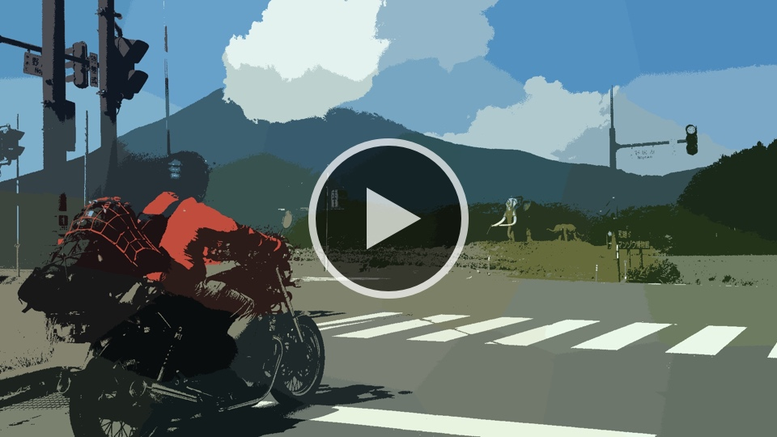

# tf-image-kit


### k-means

Here we are using k-means clustering to cluster `(x,y,r,g,b)` values. This creates an image segmentation effect.

<p align="center">
    <a href="input/nagano_train_960x720.jpeg"></a>
    <a href="input/kurohime_bike_1920x1080.jpeg"></a>
    <a href="input/flower_1856x1392.jpeg"></a>
    </br>
    </br>                               |
    </br>                               v
    </br>
    <a href="docs/media/kmeans_nagano_train_480x360_k75_wx3.0_wy3.0_40f.gif"></a>
    <a href="docs/media/kmeans_kurohime_bike_480x270_k50_wx3.0_wy1.0_40f.gif"></a>
    <a href="docs/media/kmeans_flower_464x348_k16_wx5.0_wy5.0_40f.gif"></a>
</p>

**Usage:**

```python
from kmeans import *
kmeans(filepath, k, wx = 1.0, wy = 1.0, outdir = None)
```
**Arguments:**
- `filepath` - The file path of the image to apply the k-means effect.
- `k` - The number of means/clusters.
- `wx` - A weight on the x values. Higher values will make it cluster along the x-axis.
- `wy` - A weight on the y values. Higher values will make it cluster along the y-axis.
- `outdir` - The file path to the output directory.


<!-- GIF EXAMPLES

<p align="center">
    <a href="docs/media/kmeans_nagano_train_480x360_k75_wx3.0_wy3.0_40f.gif"></a>
</p>

```python
from kmeans import *
# read from input/nagano_train_480x360.jpeg
kmeans(readpath, 75, 3.0, 3.0, outpath)
```


<p align="center">
    <a href="docs/media/kmeans_kurohime_bike_480x270_k50_wx3.0_wy1.0_40f.gif"></a>
</p>

```python
from kmeans import *
# read from input/kurohime_bike_480x270.jpeg
kmeans(readpath, 50, 3.0, 1.0, outpath)
```


<p align="center">
    <a href="docs/media/kmeans_flower_464x348_k16_wx5.0_wy5.0_40f.gif"></a>
</p>

```python
from kmeans import *
# read from input/kmeans_flower_464x348.jpeg
kmeans(readpath, 16, 5.0, 5.0, outpath)
```

-->

---
<a name="example-1"></a>
<p align="center">
    **Example 1**<br/><br/>
    <a href="https://kobejean.github.io/tf-image-kit/#example-1"></a>
</p>

```python
from kmeans import *
# read from input/nagano_train_960x720.jpeg
kmeans(readpath, 5, 0.5, 0.5, outpath)
```


---
<a name="example-2"></a>
<p align="center">
    **Example 2**<br/><br/>
    <a href="https://kobejean.github.io/tf-image-kit/#example-2"></a>
</p>

```python
from kmeans import *
# read from input/kurohime_bike_1920x1080.jpeg
kmeans(readpath, 50, 3.0, 1.0, outpath)
```


---
<a name="example-3"></a>
<p align="center">
    **Example 3**<br/><br/>
    <a href="https://kobejean.github.io/tf-image-kit/#example-3"></a>
</p>

```python
from kmeans import *
# read from input/flower_1856x1392.jpeg
kmeans(readpath, 16, 5.0, 5.0, outpath)
```

<!--  EXTRAS -->


---
<a name="example-4"></a>
<p align="center">
    **Example 4**<br/><br/>
    <a href="https://kobejean.github.io/tf-image-kit/#example-4"></a>
</p>

```python
from kmeans import *
# read from input/kurohime_bike_1920x1080.jpeg
kmeans(readpath, 50, 3.0, 3.0, outpath)
```


---
<a name="example-5"></a>
<p align="center">
    **Example 5**<br/><br/>
    <a href="https://kobejean.github.io/tf-image-kit/#example-5"></a>
</p>

```python
from kmeans import *
# read from input/nagano_train_960x720.jpeg
kmeans(readpath, 100, 4.0, 4.0, outpath)
```


---
<a name="example-6"></a>
<p align="center">
    **Example 6**<br/><br/>
    <a href="https://kobejean.github.io/tf-image-kit/#example-6"></a>
</p>

```python
from kmeans import *
# read from input/kurohime_bike_960x540.jpeg
kmeans(readpath, 100, 4.0, 4.0, outpath)
```
