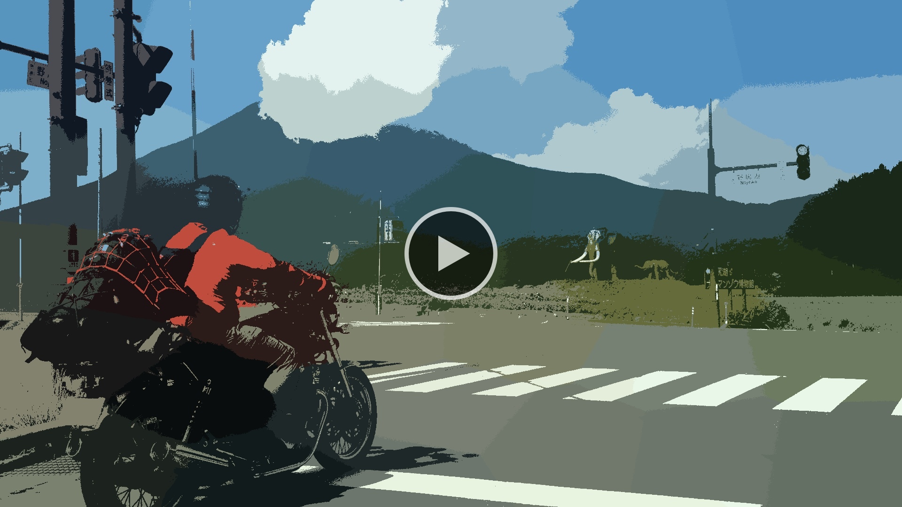
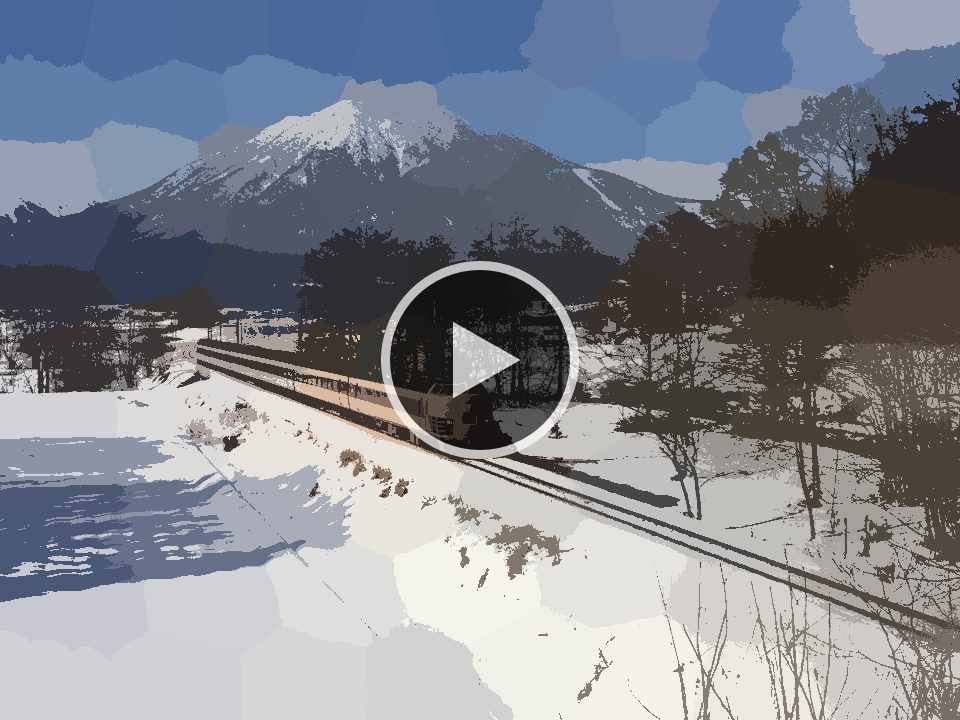
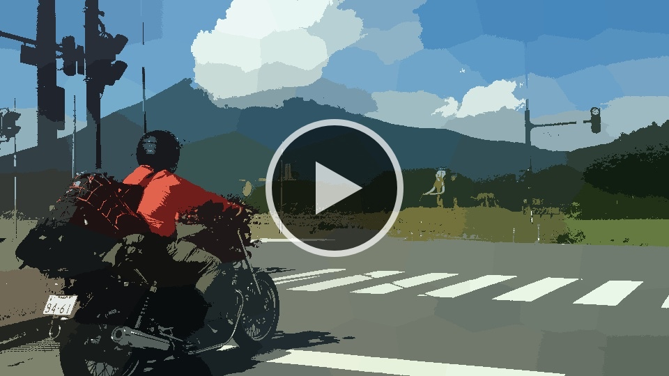

# tf-image-kit

### k-means

In this example we are using k-means clustering to cluster `(x,y,r,g,b)` values. This creates an image segmentation effect.

**Usage:**

```python
from kmeans import *
kmeans(filepath, k, wx = 1.0, wy = 1.0, outdir = None)
```
**Arguments:**
- `filepath` - The file path of the image to apply the k-means effect.
- `k` - The number of means/clusters.
- `wx` - A weight on the x values. Higher values will make it cluster along the x-axis.
- `wy` - A weight on the y values. Higher values will make it cluster along the y-axis.
- `outdir` - The file path to the output directory.


<p align="center">
    <a href="docs/media/kmeans_nagano_train_480x360_k75_wx3.0_wy3.0_40f.gif"></a>
</p>

```python
from kmeans import *
# read from input/nagano_train_480x360.jpeg
kmeans(readpath, 75, 3.0, 3.0, outpath)
```


<p align="center">
    <a href="docs/media/kmeans_kurohime_bike_480x270_k50_wx3.0_wy1.0_40f.gif"></a>
</p>

```python
from kmeans import *
# read from input/kurohime_bike_480x270.jpeg
kmeans(readpath, 50, 3.0, 1.0, outpath)
```


<p align="center">
    <a href="https://drive.google.com/open?id=0By-CMfnYF6bZSWQxa1hqM1FlaWc"></a>
</p>

```python
from kmeans import *
# read from input/flower_1856x1392.jpeg
kmeans(readpath, 16, 5.0, 5.0, outpath)
```


<p align="center">
    <a href="https://drive.google.com/open?id=0By-CMfnYF6bZcmRhczg3M0xtOWs"></a>
</p>

```python
from kmeans import *
# read from input/nagano_train_960x720.jpeg
kmeans(readpath, 5, 0.5, 0.5, outpath)
```


<p align="center">
    <a href="https://drive.google.com/open?id=0By-CMfnYF6bZNDNMWW8tNGVNNGM"></a>
</p>

```python
from kmeans import *
# read from input/kurohime_bike_1920x1080.jpeg
kmeans(readpath, 50, 3.0, 1.0, outpath)
```

<!--  EXTRAS -->

<p align="center">
    <a href="https://drive.google.com/open?id=0By-CMfnYF6bZSlUxWmJUYWNuNEE"></a>
</p>

```python
from kmeans import *
# read from input/kurohime_bike_1920x1080.jpeg
kmeans(readpath, 50, 3.0, 3.0, outpath)
```


<p align="center">
    <a href="https://drive.google.com/open?id=0By-CMfnYF6bZM0FCM1VxV0VmdEk"></a>
</p>

```python
from kmeans import *
# read from input/nagano_train_960x720.jpeg
kmeans(readpath, 100, 4.0, 4.0, outpath)
```


<p align="center">
    <a href="https://drive.google.com/open?id=0By-CMfnYF6bZSUQ4MnF1ejNQd0E"></a>
</p>

```python
from kmeans import *
# read from input/kurohime_bike_960x540.jpeg
kmeans(readpath, 100, 4.0, 4.0, outpath)
```
